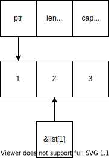
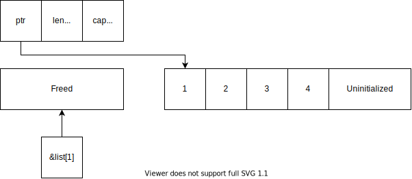
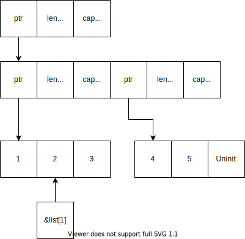
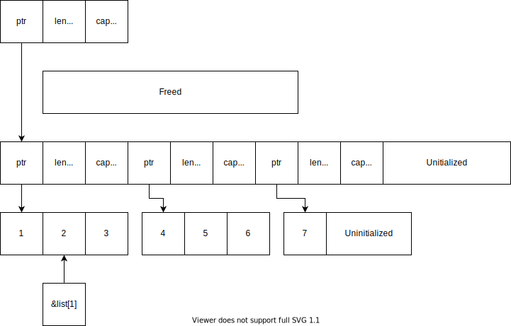

Rust's borrow checker is a powerful tool. It makes sure your code is safe by enforcing two rules:

1. Multiple immutable references or one mutable reference at a time, but not both.
2. References must always be valid.

Pretty much everyone who writes Rust has, at some point, tried to do some simple list manipulation...

```rust
let mut list = Vec::new();

// Add an item, then borrow it
list.push(1);
let first_item = &list[0];

// Oh no, we're modifying the list while it's borrowed! This fails to compile
list.push(1);
let second_item = &list[1];

// This *feels* like it should work
assert_eq!(first_item, second_item);
```

...and felt the wrath of the borrow checker.

```
error[E0502]: cannot borrow 'list' as mutable because it is also borrowed as immutable
```

Eventually, you pick up on what the compiler saying and structure your programs to satisfy the borrow checker. But it can sometimes be useful to bend the rules a bit. This post goes into the design of `AppendList`, a data structure that lets the code above compile using interior mutability, `unsafe`, and logarithms.

# The `AppendList` interface

We want a list that lets you append a new item while you hold references to other items it contains. In addition to creating a new (empty) list, we'll want to do three main things:

- Get an item by index anywhere in the list (we'll return an `Option` in case
  the index is out of bounds)
- Append a single item onto the end of the list
- Get the length of the list

In code form, it looks something like this:

```rust
pub struct AppendList<T> {
    // We'll discuss this later
}

impl<T> AppendList<T> {
    pub fn new() -> Self {
        // ...
    }

    pub fn get(&self, index: usize) -> Option<&T> {
        // ...
    }

    pub fn push(&self, item: T) {
        // ...
    }

    pub fn len(&self) -> usize {
        // ...
    }
}
```

[Rust playground](https://play.rust-lang.org/?version=stable&mode=debug&edition=2018&gist=7437f04738ae847f1e02ff21a70ab032)

In an actual release you'd probably want to implement `Index` and `Default` and maybe even `FromIterator`, but they're not hard to derive from these.

The only really interesting one is the `push` method. It takes an immutable `&self`, but will have to modify the object. This is called [interior mutability](https://ricardomartins.cc/2016/06/08/interior-mutability) because you mutate the data inside a structure even though structure itself is immutable. The most well-known example is probably the [`std::cell::Cell::set` method](https://doc.rust-lang.org/std/cell/struct.Cell.html#method.set), which has exactly the same signature as `push`.

We want this because it lets us call `push` even when there are other references to the data structure.

By the way, this doesn't fix the separate issue of references to some `Vec` elements interfering with access to other `Vec` elements. This is safe, but the borrow checker isn't smart enough to recognize it. You can solve it in a `Vec` specifically [using `split_at_mut`](https://stackoverflow.com/questions/30073684). This post only deals with pushing new elements onto the `Vec` as a whole, which even `split_at_mut` doesn't help with.

# The three approaches to interior mutability

Basically, the standard library has three tools that provide interior mutability:[^three-tools]

[^three-tools]: Three single-threaded tools. There's quite a few other tools for threaded code (e.g. [`Mutex`](https://doc.rust-lang.org/std/sync/struct.Mutex.html)).

- [`Cell`](https://doc.rust-lang.org/std/cell/struct.Cell.html)
- [`RefCell`](https://doc.rust-lang.org/std/cell/struct.RefCell.html)
- [`UnsafeCell`](https://doc.rust-lang.org/std/cell/struct.UnsafeCell.html)

`Cell` is a hunk of memory that you can change through an immutable reference, but only if you make sure that it always holds valid data. In practice, this means that you can only swap values in and out, not edit the value in place. Also, you can't get an immutable reference to its contents, so it won't be enough for us.

`RefCell` is a chunk of memory whose ownership is checked at runtime. Normally Rust does compile-time checking, but `RefCell` keeps track of how many references to it exist at runtime and decides whether to allow mutation based on the normal rules (either one mutable or multiple immutable references, but not both). The runtime checks are useful for some data structures (like linked lists), but come with a runtime cost. It also doesn't allow simple references to its contents -- you
need to use its [special reference type](https://doc.rust-lang.org/std/cell/struct.Ref.html) (or its [mutable variant](https://doc.rust-lang.org/std/cell/struct.RefMut.html)).

`UnsafeCell` is the core interior mutability primitive. Both `Cell` and `RefCell` are implemented using it under the hood, and it is the most powerful of the three. However, it can only be used with `unsafe` code, so misusing it will compromise Rust's memory safety guarantees (as we'll see). It's up to the programmer to make sure that any mutations don't end up causing problems.

Unfortunately, we're stuck using `UnsafeCell`. `Cell` doesn't allow non-`mut` references, which we need in order to implement `get`. `RefCell` has a run-time cost and can't handle mutations while non-`mut` references are out there.

# A bad approach: Just use `UnsafeCell<Vec>`

Looking at the API, it just about matches up with the ubiquitous [`std::vec::Vec`](https://doc.rust-lang.org/std/vec/struct.Vec.html)! The only issue is that `Vec` doesn't have interior mutability. But we have access to an interior mutability primitive in `UnsafeCell`. What if we just used that?


```rust
struct AppendList<T> {
    data: UnsafeCell<Vec<T>>,
}

impl<T> AppendList<T> {
    pub fn new() -> Self {
        Self {
            data: UnsafeCell::default(),
        }
    }

    pub fn get(&self, index: usize) -> Option<&T> {
        unsafe { (*self.data.get()).get(index) }
    }

    pub fn push(&self, item: T) {
        unsafe { (*self.data.get()).push(item) }
    }

    pub fn len(&self) -> usize {
        unsafe { (*self.data.get()).len() }
    }
}
```

[Rust Playground](https://play.rust-lang.org/?version=stable&mode=debug&edition=2018&gist=253a1f026bd3ed0db13fe6005bce7be9)

That was easy! Each function is just a thin wrapper over the underlying `Vec`, which makes the code super simple. The standard pattern is `(\*self.data.get())`. The call to `get()` pulls out a raw pointer to the underlying `Vec`, then `*` dereferences it, and the whole thing is wrapped in `unsafe` because we're dereferencing a raw pointer.

So let's run the test in the playground!

```
 thread 'test::thousand_items' panicked at 'assertion failed: `(left == right)`
  left: `Some(139954529247456)`,
 right: `Some(128)`', src/lib.rs:51:13
```

Well that's not great. Where did that huge number come from? Let's try that again.[^undefined]

[^undefined]: This is undefined behavior, so you might get a different number, a hang, or a crash, and it's hard to predict which. Fun!

```
thread 'test::thousand_items' panicked at 'assertion failed: `(left == right)`
  left: `Some(140315306500320)`,
 right: `Some(128)`', src/lib.rs:51:13
```

Oh no.

The number changed. That's because that number is in uninitialized memory. Somehow our implementation violated Rust's memory rules, so the safe code in the test function is dereferencing invalid memory. This approach is deeply broken. But why?

# Why the first approach is deeply broken

To understand the issue you have to know something about how a `Vec` works. A `Vec` stores three values: a pointer to a buffer, the capacity of that buffer, and the number of slots actually in use.

When you call `vec![1, 2, 3]`, you end up with a three-field struct (a pointer, a length, and a capacity). The pointer points to a buffer, which can hold up to the capacity's worth of elements. The length keeps track of how much of the buffer is used.[^vec-overallocate]

[^vec-overallocate]: `Vec` only guarantees that it allocates __at least__ enough space to fit all the elements, so the capacity might be higher than 3 in this example.



The first block of memory is put wherever you allocated your `Vec` (in our case, it's a part of the `AppendList` data layout), and it won't ever change size. The second block of memory is on the heap, and it will be reallocated whenever the length of the list is about to exceed the capacity of the memory block.

When a reallocation happens, a new chunk of memory is allocated and all the data is copied over. Then the existing chunk of memory is freed.

For example, when we insert our 4th item, the `Vec` will allocate double the space, copy over the data, and free the old buffer.



But what if there are references into the `Vec`? They are essentially pointers directly into the buffer. When the buffer is reallocated, any references have no idea that anything has changed -- they will point into the old already-freed buffer and using them in any way can cause a use-after-free error.[^unsafe-foundation]

[^unsafe-foundation]: Rust is a safe language, but remember that we used `unsafe` in this module, which means that _all_ the module's code is potentially tainted. A well-written module will guarantee that there is no way to use the publically-accessable API in an unsafe way, but even safe code in this module needs to be audited for safety. For more on this boundary, check out Jason Orendorff's talk ["Building on an unsafe foundation"](https://www.youtube.com/watch?v=rTo2u13lVcQ) and [Section 1.3](https://doc.rust-lang.org/nomicon/working-with-unsafe.html) of
[The Rustonomicon](https://doc.rust-lang.org/nomicon/README.html).

Of course, Rust prevents this by default: if you have any references into a `Vec`, you aren't allowed to mutate it. But we've completely broken
that protection! By allowing a `push` while there are references out there, we open ourselves up to use-after-free bugs. We need a better approach.

# A better approach: A list of chunks

Our main issue is that reallocation invalidates all references to that buffer. We need to find a way to allocate new data __without__ reallocating. One approach is to use a list of constant-size chunks. Whenever we run out of space, we allocate a new chunk, never letting a particular chunk reallocate. We then have a list of chunks, with each one full except for the last one.

```rust
pub struct AppendList<T> {
    chunks: UnsafeCell<Vec<Vec<T>>>,
}
```

Now we have a dynamically-sized list of chunks, each of which is some size. For example, let's pretend we are storing the values 1, 2, 3, 4, and 5 using chunks with length 3. The outer `Vec` points to a buffer containing several `Vec` headers, each of which has capacity 3.



The "Uninit" item is a piece of uninitialized memory. When a new value gets pushed, it gets placed there and the second chunk's length field is updated.[^why-not-boxed-slice]

[^why-not-boxed-slice]: Which, of course, is handled for us by the `Vec` implementation. This is why we're using `Vec<T>` instead of boxed slices ( `Box<[T]>` ) -- boxed slices would require us to do the bookkeeping around the uninitialized values ourselves.

If a second new value is pushed, a new chunk needs to be added. Because there isn't room in the list of chunks, it will have to be reallocated. However, the actual data itself won't move, so any references (like `&list[1]`) stay valid.



This structure fixes the invalid references issue.
But how will we implement `get`, `push`, and `len`?
Really, we just need to be able to calculate 3 things:

- For any particular chunk, how many values does it hold?
- For any particular chunk, what is the first index it holds?
- Which chunk is a particular index in?

We can make each of these into a small utility function. The `chunk_id` is just the index of a particular chunk in the upper `Vec`, and `index` is the position of a particular value in the data structure as a whole. For now, each chunk will be a constant size, so it is simple to determine where it begins and which chunk holds an index.

```rust
const CHUNK_SIZE: usize = 16; // We'll discuss this

/// How big is the given chunk?
fn chunk_size(_chunk_id: usize) -> usize {
    // Constant for now
    CHUNK_SIZE
}

/// Where does the given chunk start?
fn chunk_start(chunk_id: usize) -> usize {
    // Chunk 0 starts at index 0, then we go up from there
    CHUNK_SIZE * chunk_id
}

/// Which chunk does a particular index belong to?
fn index_chunk(index: usize) -> usize {
    // Division rounds down, so this works for any nonzero CHUNK_SIZE
    index / CHUNK_SIZE
}
```

With these utility functions, `get()` isn't too complex: just figure out which chunk contains the index of interest, then figure out where it is in that chunk. We end up using pretty much the same pattern as the bad example, where we use `unsafe` to reach inside the `UnsafeCell`. The `and_then` closure is just to appropriately handle the case where the user requests data from a chunk that doesn't exist yet -- it only gets called if `get(chunk_id)` returns `Some`.

```rust
pub fn get(&self, index: usize) -> Option<&T> {
    let chunk_id = index_chunk(index);
    let location = index - chunk_start(chunk_id);

    // Let Vec take care of the bounds checking for us
    unsafe { &(*self.chunks.get()) }
        .get(chunk_id)
        .and_then(|chunk| chunk.get(location))
}
```

The length is a little more complex because we have to special-case a completely empty list. Otherwise, you can just figure out where the last chunk starts and add on the number of things it has to get the overall length.[^alt-len]

[^alt-len]: You could also figure out the end of the last chunk and subtract the number of empty spaces in the previous chunk. There are options.

Also, this is the only time I'll bring up thread safety in this post, but `len()` is a good example of why `UnsafeCell` automatically makes anything that contains it not `Sync` -- we hang on to a `chunks` reference throughout this method, and if some other thread was able to modify the interior of the `UnsafeCell` it could invalidate that reference.

```rust
pub fn len(&self) -> usize {
    let chunks = unsafe { &(*self.chunks.get()) };
    
    match chunks.last() {
        // No last chunk -> empty data structure
        None => 0,
        
        // Start of the last chunk + # of items in it
        Some(last) => chunk_start(chunks.len() - 1) + last.len(),
    }
}
```

Pushing a value is a bit more complex, but it's not __too__ bad. There are two scenarios to consider:

- We still have room in the current chunk
- We've run out of room and need to create a new chunk

It's critical that the new chunk is initialized with the correct capacity. If it doesn't have enough capacity, it will be reallocated in a future `push` and we'll run into the same memory safety issues as before.

```rust
pub fn push(&self, item: T) {
    // Get a *mutable* reference to the chunk list
    let chunks_mut = unsafe { &mut (*self.chunks.get()) };

    // Where will we be inserting?
    // Note: len() handles the empty case for us
    let new_index = self.len();
    
    // Which chunk will we be inserting into?
    let chunk_id = index_chunk(new_index);
    
    if chunk_id < chunks_mut.len() {
        // Still room in the last chunk: just `push` it on
        chunks_mut[chunk_id].push(item);
    } else {
        // We need a new chunk
        
        // Create a new chunk with its full capacity but only holding one value
        let mut new_chunk = Vec::with_capacity(chunk_size(chunk_id));
        new_chunk.push(item);
        
        // Add it to the list of chunks
        chunks_mut.push(new_chunk);
    }
}
```

Ok, that was a lot of code. [Check it out in the Rust Playground](https://play.rust-lang.org/?version=stable&mode=debug&edition=2018&gist=65502589c22ce9d70808e430aea9ad9c) with the test that gave us trouble before:

```
running 1 test
test test::thousand_items ... ok

test result: ok. 1 passed; 0 failed; 0 ignored; 0 measured; 0 filtered out
```

Excellent! We've written a data structure that lets us freely index into a list and push new elements into it using one of Rust's advanced primitives.

But there are still some questions left: What's up with that constant chunk size of 16? What about those logarithms I promised? Why is `chunk_size` a function?

Those questions will have to wait for [part 2](../arraylist-part-2/), where we look at another way to determine chunk sizes and dig up some formulas from your (or at least my) high-school math class.
