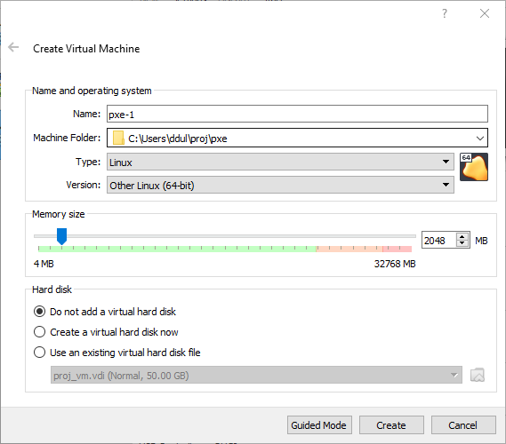
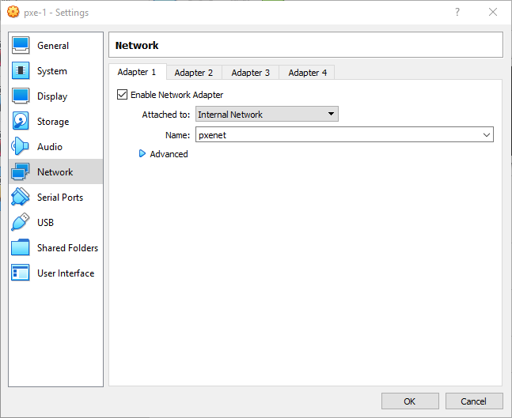
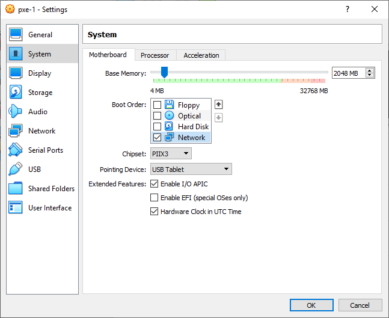
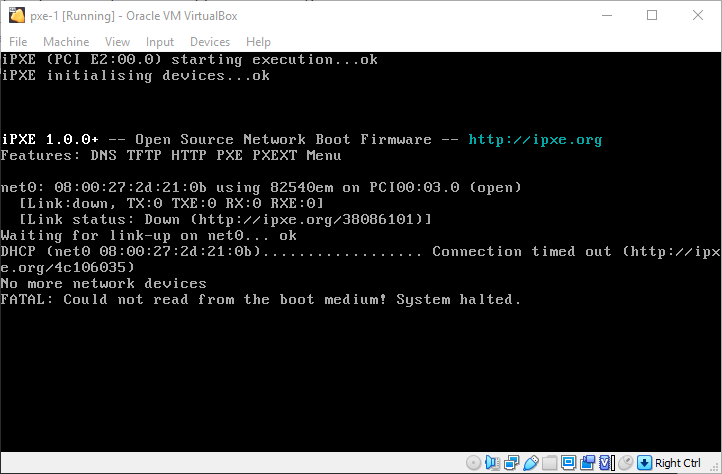
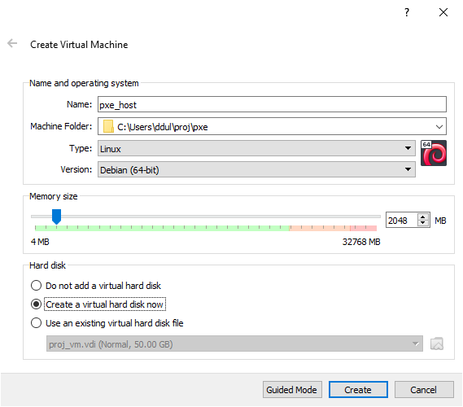
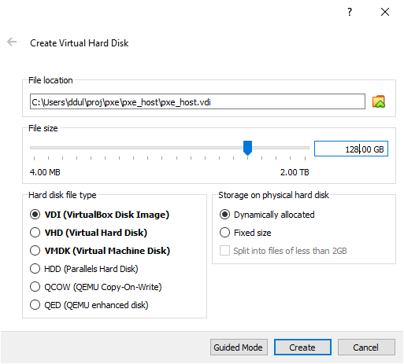
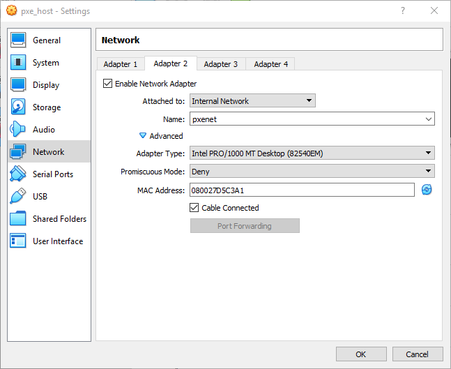
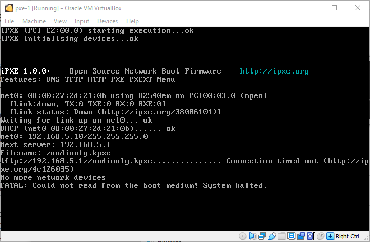

It can sometimes be useful to run a computer without any storage by booting from a network. This has a few advantages:

- Swapping failed hardware or adding new hardware is trivial; just plug it in and reboot.
- Every reboot is essentially a "reimaging", so you can update software centrally and reboot to quickly roll it out.

However, it also has a few disadvantages:

- Diskless servers can't store any data, so there needs to be some storage somewhere on the network for application state.
- Network booting requires custom DHCP settings which need to be understood and maintained.
- You have to build and store the boot files _somewhere_, which can become a single point of failure for booting the entire network.

That said, once you have more than a handful of servers, network booting can make a lot of sense. Although there are some good tutorials out there, they tend to gloss over some of the details or use black-box solutions for some of the steps. This series will attempt to use as few complex tools as possible.

# Overview

The boot process will look something like this. Don't worry if the acronyms are unfamiliar, each one is explained.

- Native PXE
- iPXE
- Linux initramfs
- Linux squashfs

# Install VirtualBox

These steps were tested with VirtualBox VMs, and the networking configuration will be specific to VirtualBox. That said, the concepts are transferrable to any hypervisor or to real hardware.

To follow along exactly, download VirtualBox from the [official site](https://www.virtualbox.org/wiki/Downloads) or from your Linux distribution.

The final article in this series will look at moving the same techniques to hardware.

# Networking and and DHCP

Network booting takes place in the [Preboot Execution Environment](https://en.wikipedia.org/wiki/Preboot_Execution_Environment) (PXE), a mini OS-within-an-OS that most computers can be configured to start instead of booting from a disk.

The goal of any PXE is to fetch the next thing to boot and start it. The native PXE is provided by your hardware[^or-a-vm], and might vary wildly in quality and features. In particular, it will probably only support downloading boot media over [TFTP](https://en.wikipedia.org/wiki/Trivial_File_Transfer_Protocol), the Trivial File Transfer Protocol.

[^or-a-vm]: Or, in our case, by the VirtualBox hypervisor.

In general, the native PXE will start by making a DHCP ([Dynamic Host Configuration Protocol](https://en.wikipedia.org/wiki/Dynamic_Host_Configuration_Protocol)) request. DHCP is used to provide computers with IP addresses. A client broadcasts a DHCP request to the entire network, then one computer on the network will be the DHCP server, which will respond to the request and provide the client with an IP address to use, as well as extra information like DNS servers.

In order to PXE boot, the DHCP server needs to respond with one more piece of data: the next server to use. The PXE will then connect to that host using TFTP and download the disk image to boot.

# Create a diskless VM

The first thing to set up is the diskless VM. Be sure to choose "Do not add a virtual hard disk", but otherwise create it as normal. I called it pxe-1, but the name is not important.



We will need to set up an internal network to allow the diskless VMs to boot. Because it will have its own DHCP server, it must be isolated from both the host machine, the Internet, and the default VirtualBox NAT network. VMs. The easiest way to do this is to create a network of type "Internal Network". The internal network option allows you to assign a name. All virtual adapters with the same internal network name will be connected together. In this case, I created an internal network called pxenet.



Finally, we need to set up the boot order. In the system section, uncheck every boot option except for Network. Optionally, you can even go to the storage section and remove the disk drive, as we won't be using it.



At this point, we can try to boot it up, but we won't get far. The native VirtualBox PXE environment starts up, but can't get an IP address over DHCP. Clearly, we need to set up a DHCP server.



# Create a host VM

Now we can set up our host VM. This will be our network's DHCP and TFTP server and will hold the OS and disk image that the diskless systems will boot from. It needs to have a boot disk. I will set up headless Debian, but just about any other distribution can be used.



You'll also need to create a disk for this VM.



Now it's time to set up networking. This VM will need two network interfaces: one to get to the Internet through local NAT, which should be created by default. The other interface will be an internal network shared with the diskless VM.



The next step is to [download](https://www.debian.org/distrib/netinst) a Debian netinst ISO file. I ended up with Debian 10.9.0, and used the amd64 architecture, but pretty much any reasonably-modern Debian should work. _Do not_ use the "Network boot" files, just the regular "Small CDs or USB sticks".

Boot to the downloaded disk and install Debian as normal.[^my-config]

[^my-config]: I used a GUI-less configuration, but you can set it up however works best for you.

At this point, the machine should have two network cards (in addition to the loopback): one for the VirtualBox NAT network (enp0s3) and one for the internal pxenet network (enp0s8). The NAT network is connected to the Internet, while the internal network is currently down.

```
$ ip address
1: lo: <LOOPBACK,UP,LOWER_UP> mtu 65536 qdisc noqueue state UNKNOWN group default qlen 1000
    link/loopback 00:00:00:00:00:00 brd 00:00:00:00:00:00
    inet 127.0.0.1/8 scope host lo
       valid_lft forever preferred_lft forever
    inet6 ::1/128 scope host
       valid_lft forever preferred_lft forever
2: enp0s3: <BROADCAST,MULTICAST,UP,LOWER_UP> mtu 1500 qdisc pfifo_fast state UP group default qlen 1000
    link/ether 08:00:27:5d:b0:8a brd ff:ff:ff:ff:ff:ff
    inet 10.0.2.15/24 brd 10.0.2.255 scope global dynamic enp0s3
       valid_lft 85928sec preferred_lft 85928sec
    inet6 fe80::a00:27ff:fe5d:b08a/64 scope link
       valid_lft forever preferred_lft forever
3: enp0s8: <BROADCAST,MULTICAST> mtu 1500 qdisc noop state DOWN group default qlen 1000
    link/ether 08:00:27:d5:c3:a1 brd ff:ff:ff:ff:ff:ff
```

We'll need to pick an IP address range to run our PXE boot network. I arbitrarily picked the 192.168.5.0/24 subnet, and chose 192.168.5.1 as the pxe-host IP, but any private address range could work. Set the static IP in pxe-host's `/etc/network/interfaces` file, then connect with `ifup`.

```
# pxe-host /etc/network/interfaces
# Static IP for PXE booting
auto enp0s8
iface enp0s8 inet static
        address 192.168.5.1/24
```

```
$ ip address
(...)
3: enp0s8: <BROADCAST,MULTICAST,UP,LOWER_UP> mtu 1500 qdisc pfifo_fast state UP group default qlen 1000
    link/ether 08:00:27:d5:c3:a1 brd ff:ff:ff:ff:ff:ff
    inet 192.168.5.1/24 brd 192.168.5.255 scope global enp0s8
       valid_lft forever preferred_lft forever
    inet6 fe80::a00:27ff:fed5:c3a1/64 scope link
       valid_lft forever preferred_lft forever
```

# Run a DHCP server

On Debian, the DHCP server is provided by the [isc-dhcp-server](https://packages.debian.org/buster/isc-dhcp-server) package.

```
$ sudo apt install isc-dhcp-server

(... snip irrelevant lines)

Setting up isc-dhcp-server (4.4.1-2) ...

(...)

Job for isc-dhcp-server.service failed because the control process exited with error code.
See "systemctl status isc-dhcp-server.service" and "journalctl -xe" for details.

(...)
```

When you install the default DHCP server, `apt` will helpfully (?) try to start it for you automatically. However, the server will notice that you haven't configured it yet, so it helpfully (?) shuts itself down. If you want to check it for yourself, you can run `sudo journalctl -xe` as it suggests.

```
May 14 14:29:53 pxe-host dhcpd[1505]: No subnet declaration for enp0s3 (10.0.2.15).
May 14 14:29:53 pxe-host dhcpd[1505]: ** Ignoring requests on enp0s3.  If this is not what
May 14 14:29:53 pxe-host dhcpd[1505]:    you want, please write a subnet declaration
May 14 14:29:53 pxe-host dhcpd[1505]:    in your dhcpd.conf file for the network segment
May 14 14:29:53 pxe-host dhcpd[1505]:    to which interface enp0s3 is attached. **
May 14 14:29:53 pxe-host dhcpd[1505]:
May 14 14:29:53 pxe-host dhcpd[1505]:
May 14 14:29:53 pxe-host dhcpd[1505]: Not configured to listen on any interfaces!
May 14 14:29:53 pxe-host dhcpd[1505]:
May 14 14:29:53 pxe-host dhcpd[1505]: If you think you have received this message due to a bug rather
May 14 14:29:53 pxe-host dhcpd[1505]: than a configuration issue please read the section on submitting
May 14 14:29:53 pxe-host dhcpd[1505]: bugs on either our web page at www.isc.org or in the README file
May 14 14:29:53 pxe-host dhcpd[1505]: before submitting a bug.  These pages explain the proper
May 14 14:29:53 pxe-host dhcpd[1505]: process and the information we find helpful for debugging.
May 14 14:29:53 pxe-host dhcpd[1505]:
May 14 14:29:53 pxe-host dhcpd[1505]: exiting.
```

We can start configuring by editing `/etc/default/isc-dhcp-server`. Add the enp0s8 interface to the INTERFACESv4 line (configuring IPv6 DHCP is left as an exercise).

```
# pxe-host /etc/default/isc-dhcp-server
INTERFACESv4="enp0s8"
INTERFACESv6=""
```

Now edit the `/etc/dhcp/dhcpd.conf` file. We need to tell dhcpd what IP address range to draw from, what TFTP server address to hand out (we'll put our own address there) and what filename the clients should request from that TFTP server.

Add these lines to the bottom of the file:

```
# pxe-host /etc/dhcp/dhcpd.conf
# Skip the rest of the file
subnet 192.168.5.0 netmask 255.255.255.0 {
  range 192.168.5.10 192.168.5.50;
  filename "/undionly.kpxe";
  next-server 192.168.5.1;
}
```

Now the DHCP server should start up without complaining.

```
$ sudo systemctl start isc-dhcp-server
$ sudo systemctl status isc-dhcp-server
● isc-dhcp-server.service - LSB: DHCP server
   Loaded: loaded (/etc/init.d/isc-dhcp-server; generated)
   Active: active (running) since Fri 2021-05-14 14:58:25 EDT; 11s ago
     Docs: man:systemd-sysv-generator(8)
  Process: 1863 ExecStart=/etc/init.d/isc-dhcp-server start (code=exited, status=0/SUCCESS)
    Tasks: 1 (limit: 2359)
   Memory: 4.8M
   CGroup: /system.slice/isc-dhcp-server.service
           └─1875 /usr/sbin/dhcpd -4 -q -cf /etc/dhcp/dhcpd.conf enp0s8

May 14 14:58:23 pxe-host systemd[1]: Starting LSB: DHCP server...
May 14 14:58:23 pxe-host isc-dhcp-server[1863]: Launching IPv4 server only.
May 14 14:58:23 pxe-host dhcpd[1875]: Wrote 0 leases to leases file.
May 14 14:58:23 pxe-host dhcpd[1875]: Server starting service.
May 14 14:58:25 pxe-host isc-dhcp-server[1863]: Starting ISC DHCPv4 server: dhcpd.
May 14 14:58:25 pxe-host systemd[1]: Started LSB: DHCP server.
```

Now we can try to boot the guest again, and we get farther this time! Now it gets an IP address and tries to connect with pxe-host over TFTP. Next time, we'll install a TFTP server and host a file.


