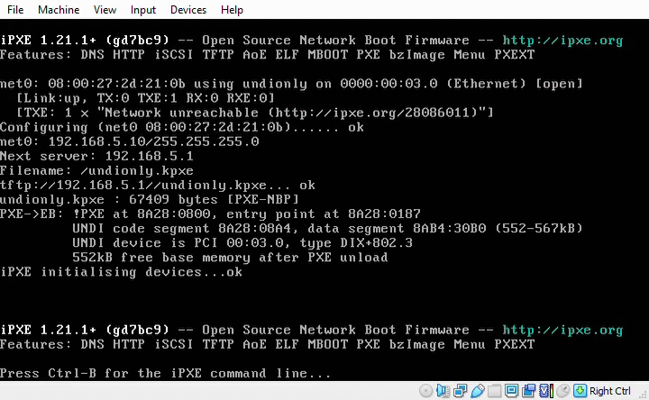
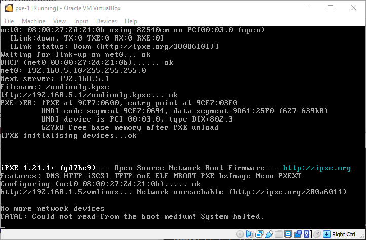

In [part 1](../pxe-from-scratch-1), we set up a diskless virtual machine (pxe-1) that gets an IP address and tries to boot from another virtual machine (pxe-host). Now, we need to actually get something booting.

<!--more-->

We'll need two things: a TFTP server to serve up some boot files and some boot files to serve.

Lets start with the TFTP server. On Debian, the ["normal" TFTP server](https://wiki.debian.org/TFTP) is [tftpd-hpa](https://packages.debian.org/buster/tftpd-hpa), so let's install that one. `apt` will helpfully (?) start it automatically.

```
$ sudo apt install tftpd-hpa
(...)
The following NEW packages will be installed:
  tftpd-hpa
(...)

$ sudo systemctl status tftpd-hpa
● tftpd-hpa.service - LSB: HPA's tftp server
   Loaded: loaded (/etc/init.d/tftpd-hpa; generated)
   Active: active (running) since Fri 2021-05-14 22:51:41 EDT; 4min 48s ago
     Docs: man:systemd-sysv-generator(8)
    Tasks: 1 (limit: 2359)
   Memory: 580.0K
   CGroup: /system.slice/tftpd-hpa.service
           └─680 /usr/sbin/in.tftpd --listen --user tftp --address 0.0.0.0:69 --secure /srv/tftp

May 14 22:51:41 pxe-host systemd[1]: Starting LSB: HPA's tftp server...
May 14 22:51:41 pxe-host tftpd-hpa[673]: Starting HPA's tftpd: in.tftpd.
May 14 22:51:41 pxe-host systemd[1]: Started LSB: HPA's tftp server.
```

By default (configurable in `/etc/default/tftpd-hpa`), the TFTP server will serve files out of `/srv/tftp`.

But what to put there? Eventually we will need to serve up a Linux kernel and a basic initramfs filesystem, but TFTP isn't exactly the ideal protocol for large files.[^tftp-slow] Ideally, we would serve those over something like HTTP(S) or SFTP/SCP, but the native PXE that comes with some random motherboard probably won't support that.

[^tftp-slow]: TFTP is a UDP-based protocol that only allows one fixed-size block at a time to transfer. This means that only a small amount of data (usually 1-2 kB) can be "in flight" at a time. Contrast this with TCP, which allows [a dynamically-sized window](https://www.extrahop.com/company/blog/2017/tcp-windowing/) of unacknowledged bytes.

A better idea is to load a purpose-built network bootloader. This is known as [chainloading](https://ipxe.org/howto/chainloading): using the (potentially janky) native PXE to download a known-good, preconfigured PXE.

A good choice for a native PXE is [iPXE](https://ipxe.org/start), an open-source boot firmware that we can easily compile with our own script.

We'll start by installing a bunch of build tools.[^build-tools]

[^build-tools]: `git` to get the source code, `gcc` and `binutils` to actually build it, `make` and `perl` to orchestrate the build process, and `liblzma-dev` and `zlib1g-dev` to provide compression library headers.

```
$ sudo apt install git gcc binutils make perl liblzma-dev zlib1g-dev
```

Now we can get the iPXE source from their git repository (for posterity, I'm using [d7bc9e](https://github.com/ipxe/ipxe/tree/d7bc9e9d67c2e7a4d2006d2c48485b3265aea038)) and build it.

```
$ git clone git://git.ipxe.org/ipxe.git
$ cd ipxe/src
$ make bin/undionly.kpxe
```

This will build a chainloadable iPXE image. Note that the filename matches the DHCP configuration from [part 1](../pxe-from-scratch-1).

Now we can just put it into the TFTP server directory at `/srv/tftp`, and we're off!

```
$ sudo cp bin/undionly.kpxe /srv/tftp/
```



We've hit one of the edge cases that can sometimes show up with PXE booting: a boot loop! What's happening is that the native PXE uses TFTP to fetch the undionly.kpxe file we just compiled (which we can confirm by looking at the iPXE version: d7bc9 is the git commit we compiled from).

Once iPXE starts running, it gets an IP address using DHCP, along with the TFTP information, which it uses to download iPXE, which it then boots into. Once iPXE starts running, it gets an IP address using DHCP, which it uses to download iPXE, which it then boots into. Once iPXE starts running...

So how do we break out of this boot loop? There are [a few different methods](https://ipxe.org/howto/chainloading), but the easiest to set up (i.e. doesn't require messing with the DHCP configuration) is an [embedded iPXE script](https://ipxe.org/embed).

Lets start by just messing with iPXE. On one of the boot loops, press Ctrl+B to fall into the iPXE command prompt. The `help` command brings up a list of available commands.

We care about four of them.

- `dhcp` runs a DHCP client on each interface to get an IP. This command should pretty much always be run before making any network requests.
- `kernel` indicates a Linux (or other) kernel image to use. We can specify a URL, like `http://192.168.5.1/vmlinuz`.
- `initrd` indicates a Linux initramfs image to use. We can specify a URL, like `http://192.168.5.1/initrd.img`. Don't worry if you're not familiar with this file, we'll cover it in the next section.
- `boot` tells iPXE to boot to the kernel.

So let's put together a quick iPXE script that tries to fetch a Linux installation from our pxe-host VM over HTTP. Create a new file called `http.ipxe` in the `ipxe/src` directory. Add the following lines, noting that the shebang line is important, but that the file does not have to be executable.

```
#!ipxe

# Get an IP address over DHCP
dhcp

# Fetch the kernel and initramfs image from VM
kernel http://192.168.1.5/vmlinuz
initrd http://192.168.1.5/initrd.img

# Boot using the downloaded kernel
boot
```

Now rebuild `bin/undionly.kpxe`, but with an extra parameter indicating the path to the script file, and copy the resulting file over to the `/srv/tftp` directory.[^remove-features]

[^remove-features]: One thing that could improve performance at this step is removing features from the built kpxe file. Right now, we're using the default iPXE feature set, which is fairly rich. Paring down to only the parts we actually need might help reduce the TFTP transfer time slightly. That said, the built kpxe file is fairly small already (66 KB on my machine), so TFTP is most likely not a huge part of the latency.

```
$ make bin/undionly.kpxe EMBED=http.ipxe
$ sudo cp bin/undionly.kpxe /srv/tftp/
```

Now when boot the native PXE environment runs our custom iPXE script, which tries its level best to fetch our kernel, but runs into the _small issue_ that there isn't actually an HTTP server running on pxe-host.



We've successfully chainloaded iPXE and broken out of the boot loop. Next time, we'll set up an HTTP server on pxe-host to let us boot into a Linux kernel.
