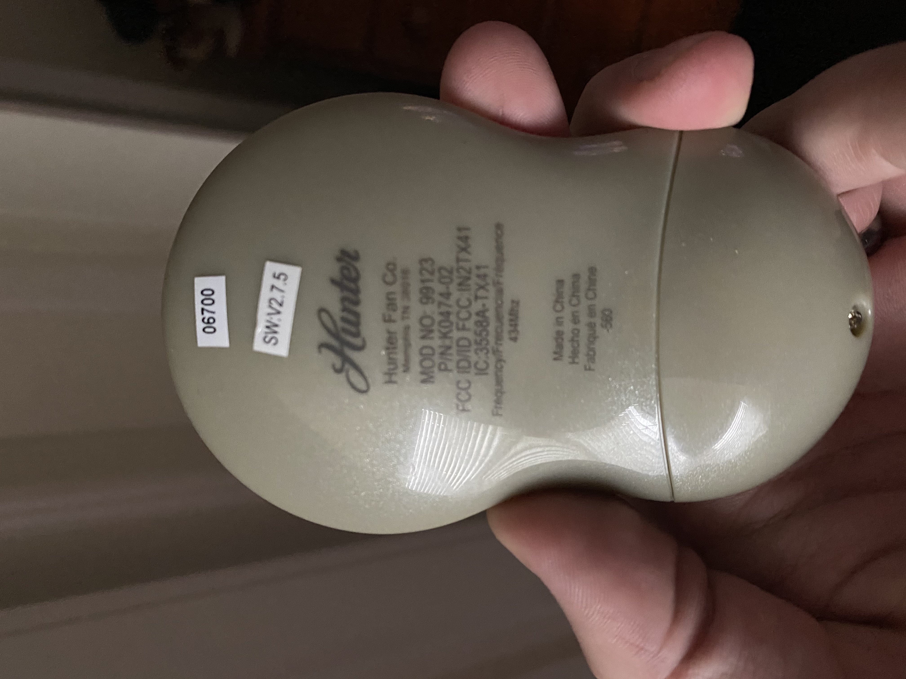

My apartment came with a ceiling fan/light combination made by the [Hunter Fan Company](https://www.hunterfan.com/). It is controlled by [model 99123](https://www.hunterfan.com/products/ceiling-fan-accessories-fan-light-universal-handheld-remote-control-desert-platinum-99123) remote control, which appears to be a proprietary remote using the 434 MHz RF band. I'd like to be able to control my bedroom light and fan with one of these [no-name 434 MHz transmitters](https://www.amazon.com/gp/product/B07PDGKW8B), but there does not appear to be any documentation on the control protocol (or at least, I don't know what keywords to search for).

Unfortunately, the remote was provided by my landlord and a replacement costs over $70, so I don't want to take it apart. Ideally, I would be able to sniff its signals and recreate them well enough to reliably control the light and fan.

Enter the fantastic [RTL-SDR](https://www.rtl-sdr.com/about-rtl-sdr/)! I got one a while ago to sniff ADS-B transponders at my local airport, but never got around to setting it up. Is it up to the task of reversing this remote control?

# Recording signals with the RTL-SDR

If you've never tried one, I can highly recommend picking up an RTL-SDR radio. They're incredibly cheap ($28 from the [official store](https://www.rtl-sdr.com/product/rtl-sdr-blog-v3-r820t2-rtl2832u-1ppm-tcxo-sma-software-defined-radio-dongle-only/)) and work well enough for basic analysis.

I started off following the [Quick-Start Guide](https://www.rtl-sdr.com/rtl-sdr-quick-start-guide/), which walks you through installing SDRSharp.
